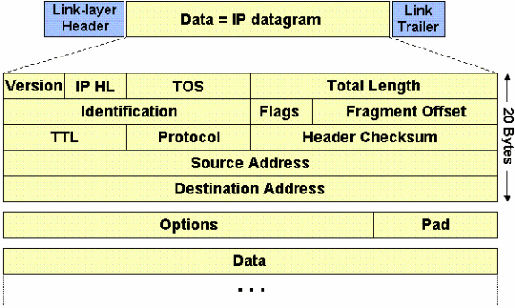
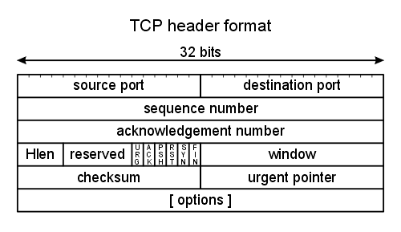
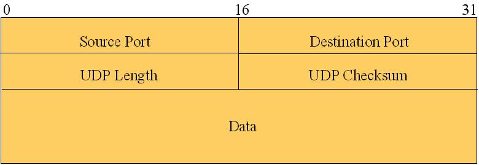
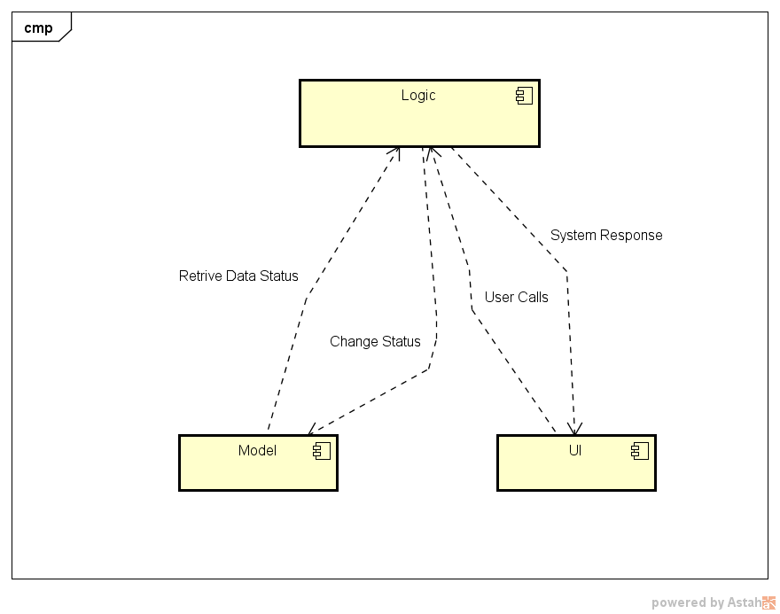
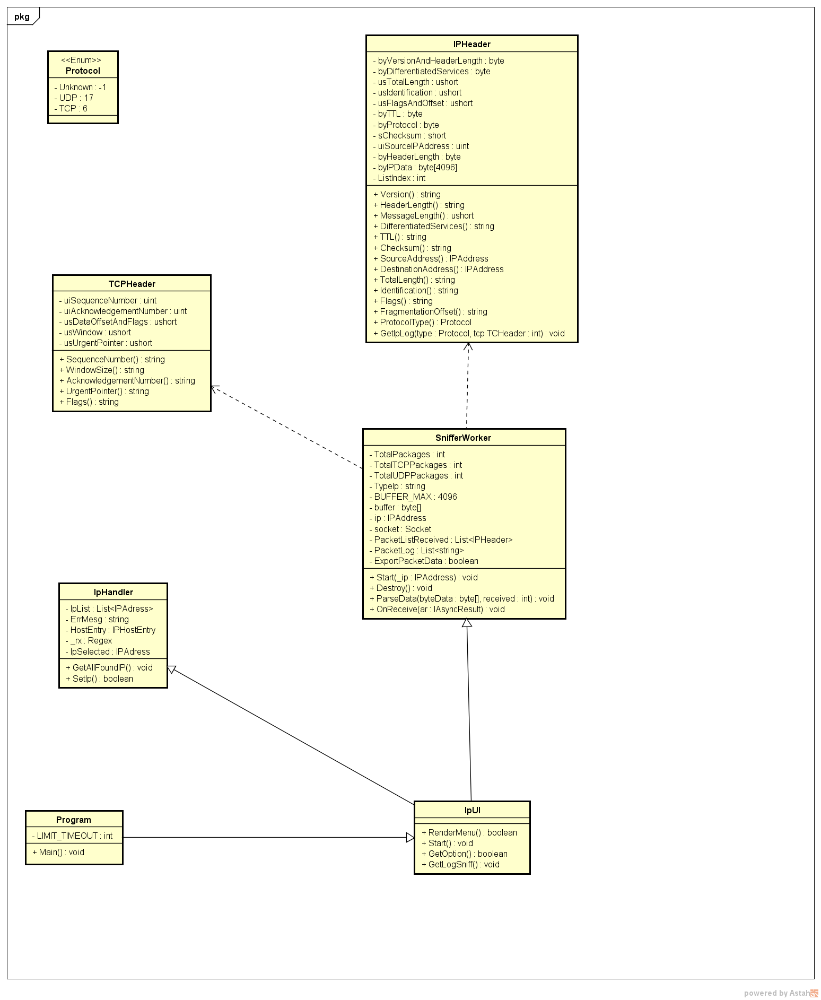

# Sniffer
An Sniffer of packages

This application was based on the lib [NetworkSnifferLib]: https://github.com/TheLe0/NetworkSnifferLib .With this, you can sniff some IP on your machine(only v4 implemented until now), for a estimated time, and get a little of information about it.

## IP V4  Protocol Header ##

## TCP Protocol Header ## 

## UDP Protocol Header ##

## Components Architecture Diagram

## Implementation Class Diagram

## Information Given ##

* [x] IP Version;
* [x] An overall of packages sniffed;
* [x] Total TCP packages sniffed;
* [x] Lost packages;
* [x] Information about each package header.

## Configuration ##

You will need to execute the application as a administrator, if you are going to run on VS or VS Code, run the VS as an administrator.
